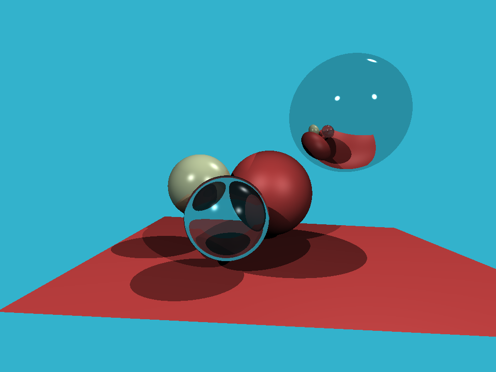

# Tiny Ray Tracer - Rust

 

## What is it?
Learning about Ray Tracing by build a basic Ray Tracer. Following [Understandable RayTracing in 256 lines of bare C++](https://github.com/ssloy/tinyraytracer/wiki) but doing it in Rust.

## Where we at?
This is our current progress vs. where we are heading:

## So what's the plan?
  1. We'll recreate the tiny ray tracer in Rust
  2. Optimize & Benchmark scene rendering
  3. See what [Rayon](https://github.com/rayon-rs/rayon) can do to speed this up on a CPU
  4. Try to do something funny, call [JAX](https://github.com/google/jax) from Rust and see if we can do the rendering on GPU/TPU that way.
